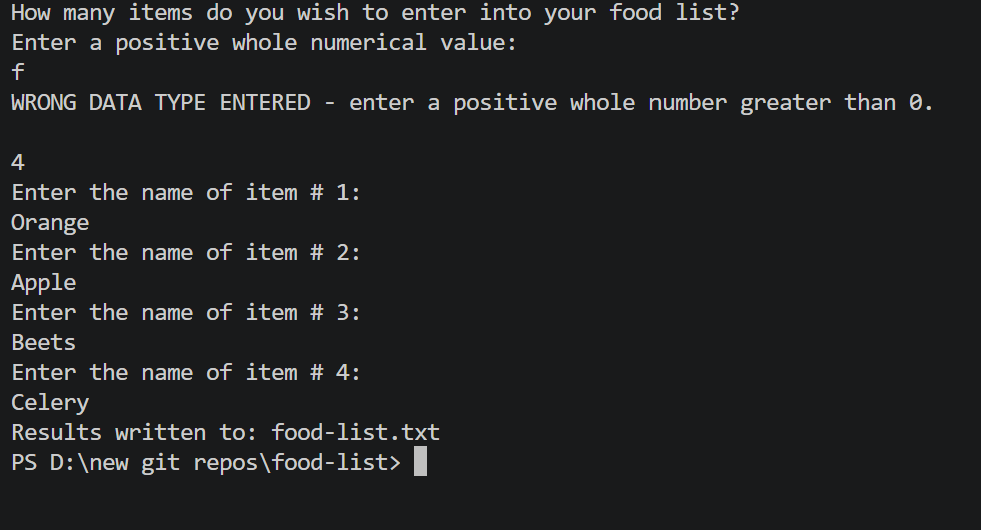

# 🍎 Food List — Create, Sort, and Display

A Python program that collects food items into a list using a **FOR loop**, then displays the list in unsorted, ascending (A–Z), and descending (Z–A) sorted order. All output is written to a user-named external text file.

---

## ✨ Features

- Prompts for a user-defined output file name
- Validates that the item count is a positive whole number
- FOR loop collects each food item by name
- Rejects blank entries — user must enter a non-empty item name
- Writes the unsorted list to the output file
- Sorts the list ascending (A–Z) using `.sort()` and writes to file
- Sorts the list descending (Z–A) using `.sort(reverse=True)` and writes to file
- All three versions are written to a single `.txt` output file

---

## ⚙️ How It Works

1. User enters a name for the output file (include `.txt` extension e.g. `foods.txt`)
2. User enters how many food items to add to the list
3. FOR loop prompts for each item name — blank entries are rejected
4. Unsorted list is written to the output file
5. List is sorted ascending and written to the output file
6. List is sorted descending and written to the output file
7. File is closed and user is notified

---

## 📄 Example Output File

```
==================================================
               UNSORTED FOOD LIST
==================================================
                    pizza
                    apple
                  broccoli
                    mango
==================================================

==================================================
         SORTED FOOD LIST (ASCENDING A-Z)
==================================================
                    apple
                  broccoli
                    mango
                    pizza
==================================================

==================================================
         SORTED FOOD LIST (DESCENDING Z-A)
==================================================
                    pizza
                    mango
                  broccoli
                    apple
==================================================
```

---

## 📸 Screenshot



---

## 🛠️ Technologies Used

- Python 3
- `for` loop with `range()` — list population
- Python lists — `[""] * numItems` to initialize
- `list.sort()` — ascending sort
- `list.sort(reverse=True)` — descending sort
- File I/O — `open()`, `write()`, `close()`
- `while True / try/except` — input validation
- f-strings with `^50s` — centered text formatting

---

## 📚 Learning Outcomes

- Defining and initializing a Python list
- FOR loop list population with index control
- Built-in `list.sort()` and `list.sort(reverse=True)` methods
- Writing multiple formatted sections to a single output file
- Blank-input validation inside a nested loop
- Centered text formatting with f-strings

---

## ▶️ How to Run

1. Make sure Python 3 is installed: https://www.python.org/downloads/
2. Clone or download this repo
3. Open a terminal in the repo folder
4. Run: `python food_list.py`
5. Enter a filename when prompted (include `.txt` e.g. `foods.txt`) — the report will be created in the same folder

---

## 📁 Folder Structure

```
food-list/
├── food_list.py
├── output.png
├── README.md
├── LICENSE
└── .gitignore
```

---

## 📜 License

This project is licensed under the MIT License — see the [LICENSE](LICENSE) file for details.

---

*Written by Marlena Fabrick — Computer Programming, Fall 2020*
